**Disclaimer**: The context, Company, CEO and business questions are ficticial.

The objective of this project is to delivery a sales forecast model for the Rossmann Chief Financial Officer, where it's possible to consult the forecast sales about the nexts 6 weeks for each store. Which this information, the CFO will be cappable to set a specific budget for store renovations.

This project was developed by using a CRISP-DM method,where the goal is do the first round as soon as possible, and at the end of the first development cycle it was possible to produce a prediction model with a MAPE Error index of 9% using the XGBoost algorithm.

# 1 - Business Problems

## 1.1 - Rossmann

Rossmann is one of the largest drug store chains in Europe with around 56,200 employees and more than 4000 stores. In 2019 Rossmann had more than €10 billion turnover in Germany, Poland, Hungary, the Czech Republic, Turkey, Albania, Kosovo and Spain.

The company was founded in 1972 by Dirk Rossmann with its headquarters in Burgwedel, near Hanover, Germany. The product range includes up to 21,700 items and may vary depending on the size of the store and location.

## 1.2 - Business Problems

The CFO of Rossmann needs to renovate the stores and to set up an accurate budget, he has requested a revenue forecast for each store for the next six weeks.

The data science team were resopnsible for the solution development, which is described bellow.

## 1.3 - About the Data
The datasets were from a [Kaggle Competition](https://www.kaggle.com/c/rossmann-store-sales) 

The datasets were about 1.115 stores, and the descripton about some filds can be checked bellow. 

|Variable | Definition|
|-------- | -------------|
|Assortment| describes an assortment level: a = basic, b = extra, c = extended |
|CompetitionDistance| distance in meters to the nearest competitor store|
|CompetitionOpenSince[month/year]| gives the approximate year and month of the time the nearest competitor was opened |
|Customers | the number of customers on a given day |
|Date| represents the date the drugstore information began to be collected |
|Id | represents a (Store, Date) duple within the test set |
|Is_promo | indicates whether a store is running a promo on that month |
|Open | an indicator for whether the store was open: 0 = closed, 1 = open |
|Promo | indicates whether a store is running a promo on that day |
|Promo2 | is a continuing and consecutive promotion for some stores: 0 = store is not participating, 1 = store is participating |
|Promo2Since[year/week] | describes the year and calendar week when the store started participating in Promo2 |
|PromoInterval | describes the consecutive intervals Promo2 is started, naming the months the promotion is started anew. E.g. "Feb,May,Aug,Nov" means each round starts in February, May, August, November of any given year for that store |
|Sales | the turnover for any given day |
|SchoolHoliday | indicates if the (Store, Date) was affected by the closure of public schools|
|StateHoliday | indicates a state holiday. Normally all stores, with few exceptions, are closed on state holidays. Note that all schools are closed on public holidays and weekends. a = public holiday, b = Easter holiday, c = Christmas, 0 = None|
|Store | a unique Id for each store |
|StoreType | differentiates between 4 different store models: a, b, c, d| 

# 2 - Solution Strategy

The solution follows the CRISP-DM (Cross-Industry Standard Process for Data Mining), which is a cyclic method of development. At the end of the first cycle, the team will have a first version end-to-end of this solution, allowing them to achieve good results faster and identify and address potential problems effectively.

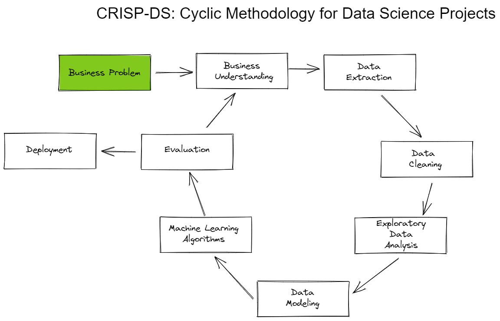

## 2.1 - Business Understanding

In this initial phase, the focus was on understanding the company's business and clarify wich are the project's objectives and requirements.

## 2.2 - Data Extraction

The data science team received a csv file containing the sales made for each store during one year period. And the solution was developed with these datas.

## 2.3 - Data Descriptive

Also were done a data descriptive, focusing on identify and udenderstand if there are some outliers, missing values and data distribution for each feature, individually.
The descriptive analysis can be accessed at the link bellow.

[Descriptive Analysis](notebooks/data_descriptive.html)

Before starting to work with the data, the dataset was separated into 3 new datasets, which were used to ensure machine learning model training without overfitting.

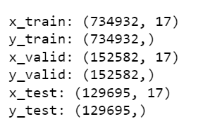

The 3 new dataset are presented below:

**Train**: contains around 70% of data and it's used for machine learning algorithm training. 

**Validation**: contains around 15% of data and it's used to set the best parameters.

**Test**: Also contains around 15% of the data and it's used to evaluate the model performance.

## 2.4 - Data Cleaning

As part of data cleaning the missing values were identified and filled following some assumptions that are described on the notebook.

## 2.5 - Feature Engineering

On this step, some features were created aiming to improve the model performance as well as gain some some business experience and insights.

For this task, a technique called Mind Map Hypothesis was used, where new features were created based on hypotheses that were made and later validated.
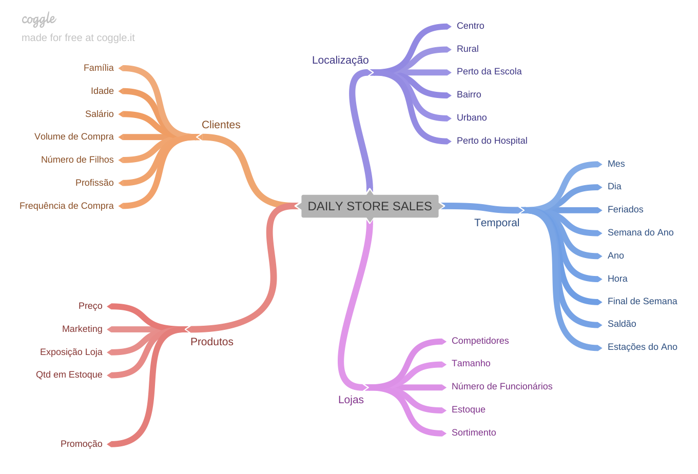

## 2.6 - Data Filtering

In this phase, we have implemented a filter on our dataset as it doesn't make sense to include data where, for example, the store was closed and no sales were made. Our objective is to predict sales ($$), and such data would be irrelevant.

## 2.7 - Exploratory Data Analysis
This phase has involved exploring the data, identifying patterns, and gaining insights into its characteristics. As part of the exploratory data analysis, were made the analysis below:

- Univariate Analysis for variable response
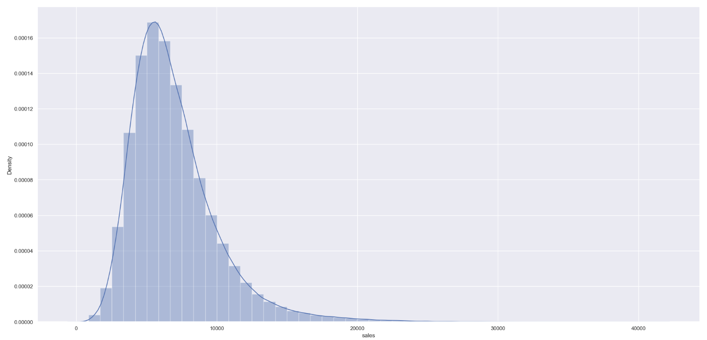

- Univariate Analysis for numerical features
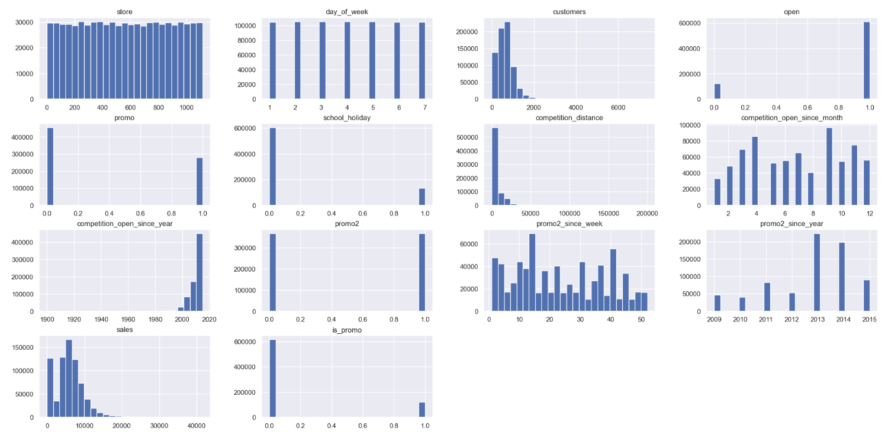

- Univariate Analysis for categorical features

- Bivariate Analysis
The hypothesis made during the feature engineering process were validated on this phase.

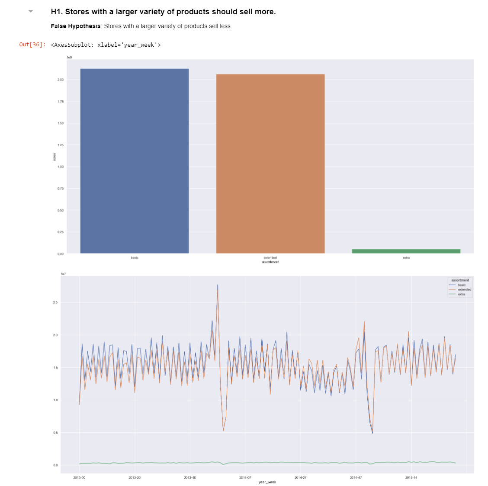
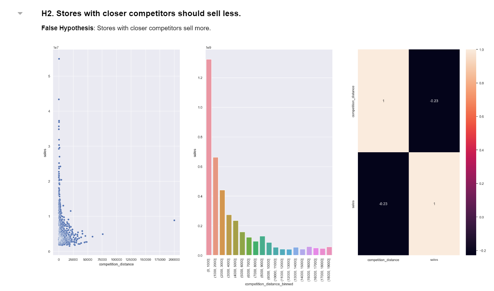
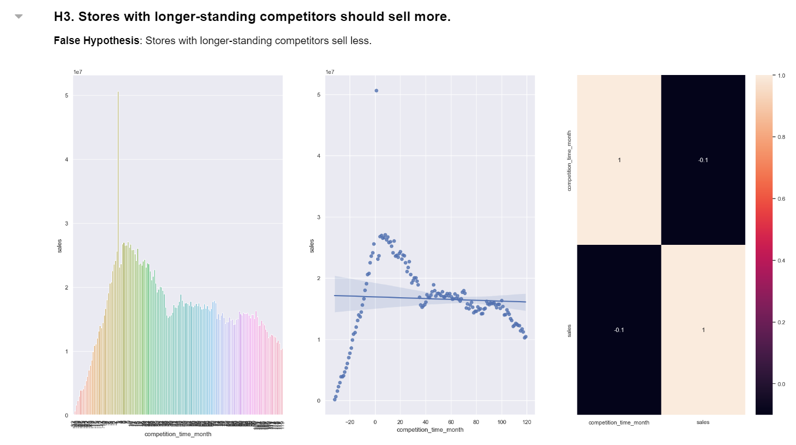
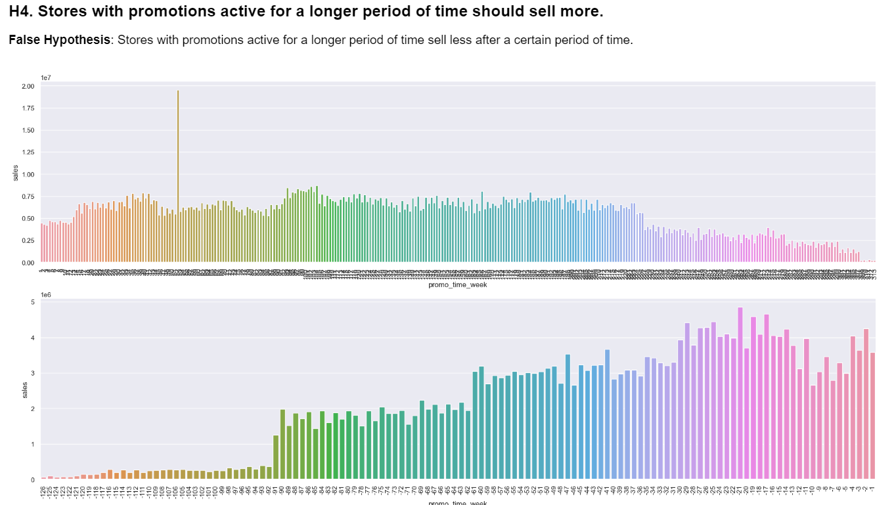
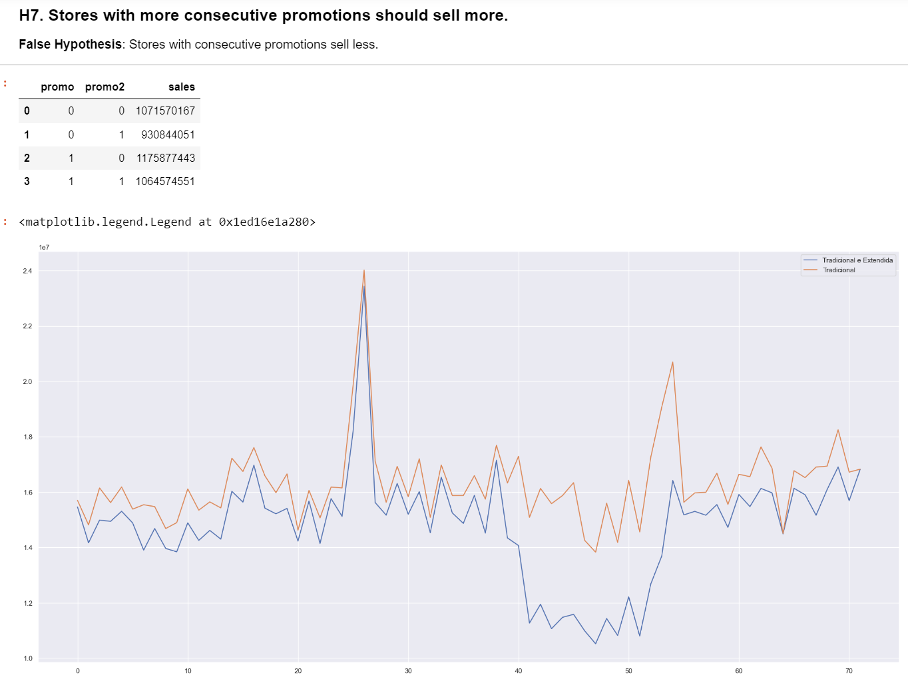
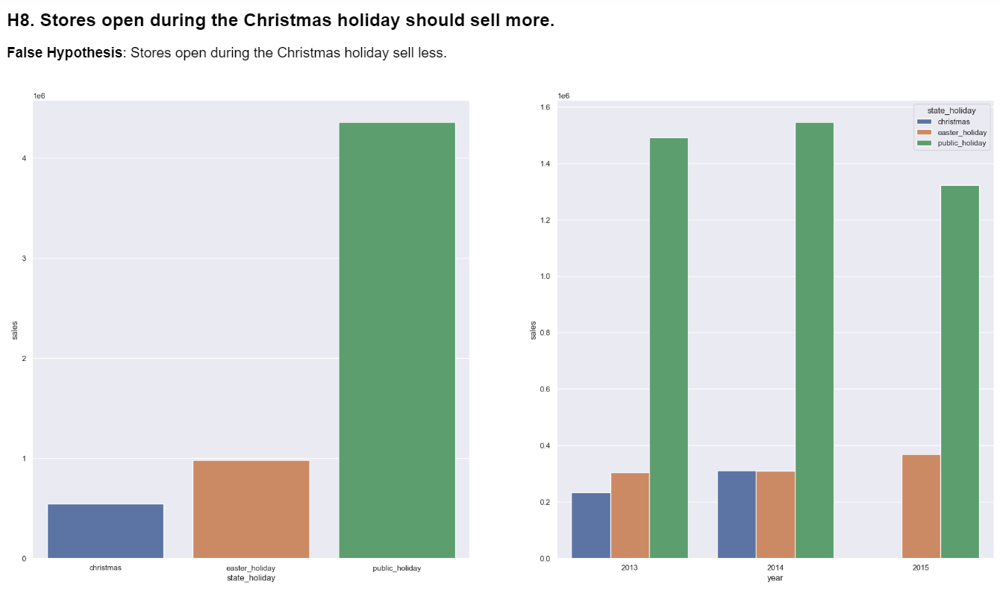
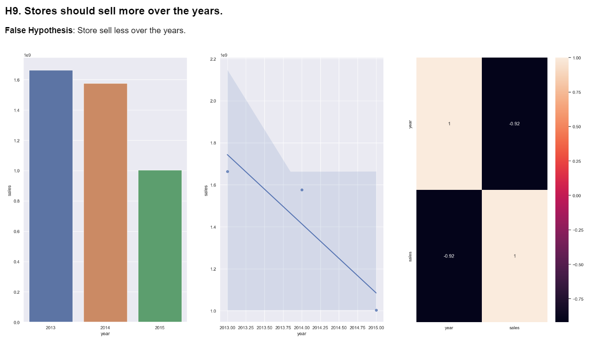
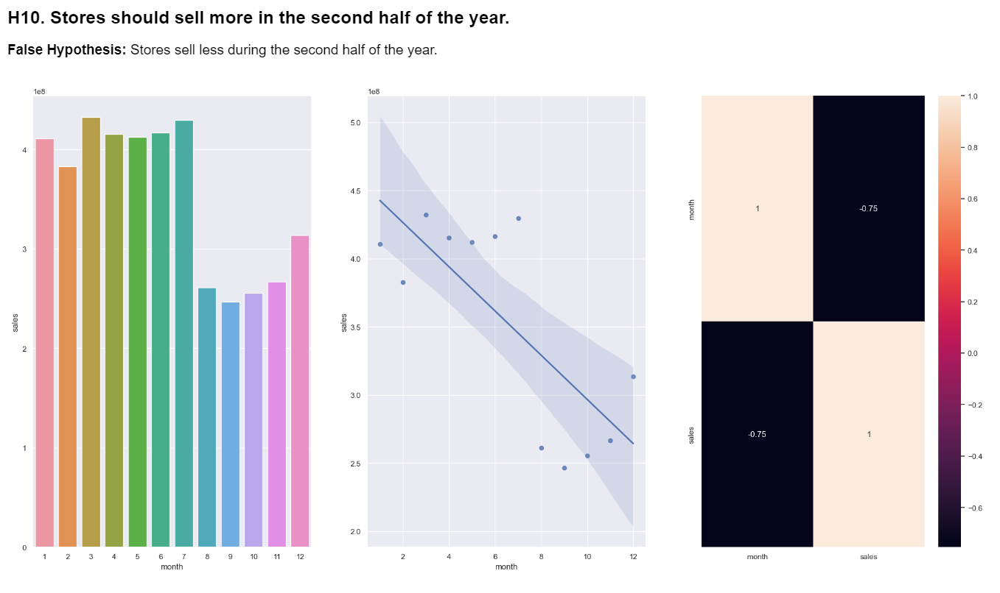
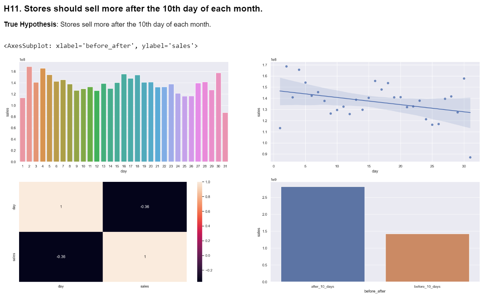
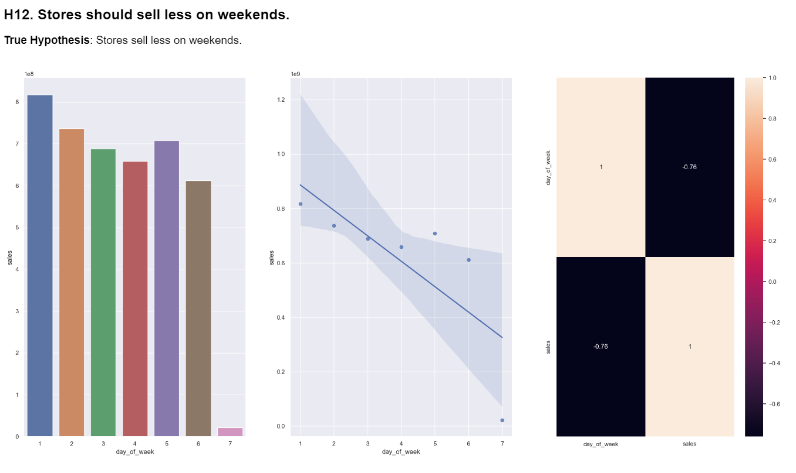
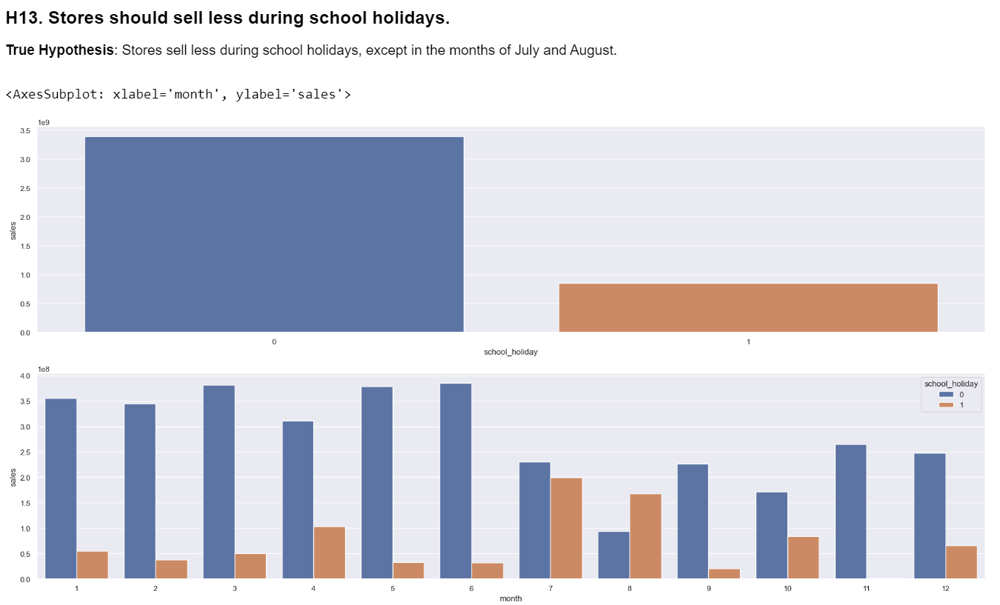

- Multivariate Analysis
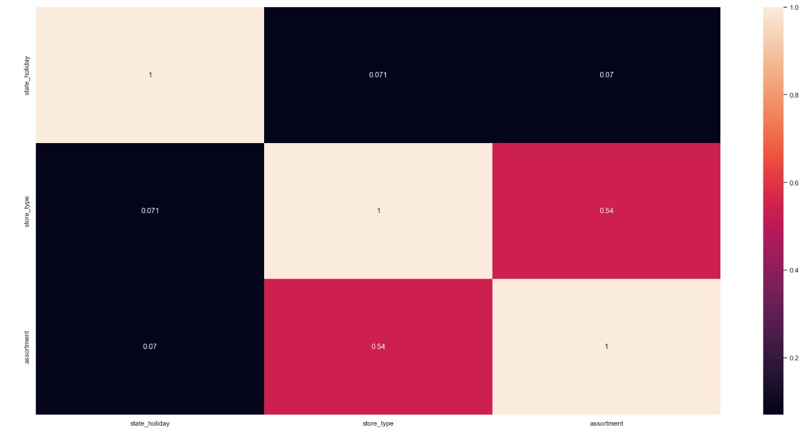

## 2.8 - Data Modeling
In this phase were done data transformations to normalize the scale of features, help make the distribution more summetrical aiming to improve the ML model performance.

Data transformations methods used:
- Robust Scaler
- Min. Max. Scaler
- Hot Encoding
- Label Encoding
- Ordinal Encodign

These transformation were applied on training and validation dataset.

## 2.9 - Machine Learning Algorithms

### 2.9.1 - Feature Selection
This phase started by doing a feture selection using Extra Trees Classifier, aiming to select only the most important features to be used to train the machine learning models.

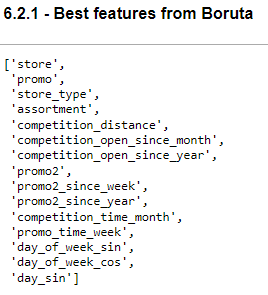

Besides these features, during the hypothesis validation, some other important features were identified and considered for the application of Machine Learning.
At the end, the features selected to training and perform with the ML algorithm were as per below:

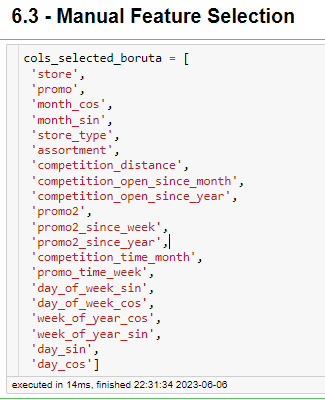

### 2.9.2 - Machine Learning Model training and performance
In this phase, some machine learning model were trained and their performance were calculated.

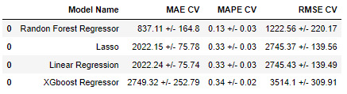

Considering not only the ML results but also the resources such as processor, memory and performance, the XGBoost Regressor were selected to be the main algorithm to solve this business problem.
The fine tuning technique was made aiming to find the best parameters for XGB Regressor and one last training were performed using the best parameters and the performance were calculated using the test dataset, to be more accurate and closer to the real performance for the algorithm.

# 3 - Business Results

According to the business problem which was to predict how much each store will sell over the next 6 weeks, the DataScience Team deployed the machine learning model to production using flask framework and developed a Telegram Bot which can be accessed from computer or even a mobile phone.

The user can simply send a text message to the Telegram bot, specifying the store number. The bot, will then provide a text message response indicating the projected sales for that particular store over the next 6 weeks.

You can check the Telegram BOT working below.

To access the Telegram bot, you can either use the provided link or scan the QR code below:

[Telegram Bot](https://t.me/rossmannribot)

# 5 - Next Steps

As this was the first cycle, there are improvements to be considered in order to achieve the best performance.
- Work on feature engineering, creating new features that could better explain the phenomenon.
- Work on fine tuning, focused on find the best parameter to improve the metric.
- Get more data and re-training the ML model.

# AUTHOR
Ricardo Perottoni

# All Rights Reserved - Comunidade DS 2022
 