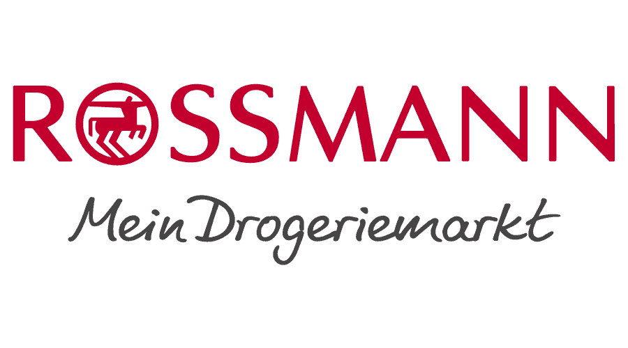
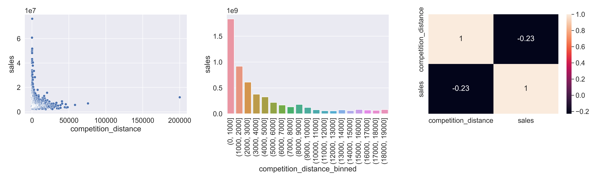
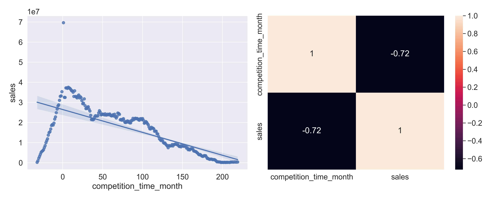

# ROSSMANN SALES PREDICTION

**Disclaimer**: The context, Company, CEO and business questions are ficticial.

 The objective of this project is to delivery a sales forecast model for the Rossmann Chief Financial Officer, where it's possible to consult the forecast sales about the nexts 6 weeks for each store. Which this information, the CFO will be cappable to set a specific budget for store renovations.

This project was developed by using a CRISP-DM method, where the goal is do the first round as soon as possible, and at the end of the first development cycle it was possible to produce a prediction model with a MAPE Error index of 9% using the XGBoost algorithm. 

# Table of Contents

* [1. Business Scenario](#1-business-scenario)
* [2. Solution Strategy](#2-solution-strategy)
* [3. Data Filtering](#3-data-filtering)
* [4. Hypothesis and Insights](#4-hypothesis-and-insights)
* [5. Machine Learning Models](#5-machine-learning-models)
* [6. Business Results](#7-business-outcome)
* [7. Next Steps](#8-next-steps)
* [8. Technologies](#9-technologies)

# 1. Business Scenario

## 1.1 - Rossmann Mein Drogeriemrkt

Rossmann is one of the largest drug store chains in Europe with around 56,200 employees and more than 4000 stores. In 2019 Rossmann had more than €10 billion turnover in Germany, Poland, Hungary, the Czech Republic, Turkey, Albania, Kosovo and Spain.

The company was founded in 1972 by Dirk Rossmann with its headquarters in Burgwedel, near Hanover, Germany. The product range includes up to 21,700 items and may vary depending on the size of the store and location.

## 1.2 - Business Problems

The CFO of Rossmann needs to renovate the stores and to set up an accurate budget, he has requested a revenue forecast for each store for the next six weeks.

The data science team were resopnsible for the solution development, which is described bellow. 

## 1.3 - About the Data
The datasets were from a [Kaggle Competition](https://www.kaggle.com/c/rossmann-store-sales) 

The datasets were about 1.115 stores, and the descripton about the variables can be checked bellow. 

|Variable | Definition|
|-------- | -------------|
|Assortment| describes an assortment level: a = basic, b = extra, c = extended |
|CompetitionDistance| distance in meters to the nearest competitor store|
|CompetitionOpenSince[month/year]| gives the approximate year and month of the time the nearest competitor was opened |
|Customers | the number of customers on a given day |
|Date| represents the date the drugstore information began to be collected |
|Id | represents a (Store, Date) duple within the test set |
|Is_promo | indicates whether a store is running a promo on that month |
|Open | an indicator for whether the store was open: 0 = closed, 1 = open |
|Promo | indicates whether a store is running a promo on that day |
|Promo2 | is a continuing and consecutive promotion for some stores: 0 = store is not participating, 1 = store is participating |
|Promo2Since[year/week] | describes the year and calendar week when the store started participating in Promo2 |
|PromoInterval | describes the consecutive intervals Promo2 is started, naming the months the promotion is started anew. E.g. "Feb,May,Aug,Nov" means each round starts in February, May, August, November of any given year for that store |
|Sales | the turnover for any given day |
|SchoolHoliday | indicates if the (Store, Date) was affected by the closure of public schools|
|StateHoliday | indicates a state holiday. Normally all stores, with few exceptions, are closed on state holidays. Note that all schools are closed on public holidays and weekends. a = public holiday, b = Easter holiday, c = Christmas, 0 = None|
|Store | a unique Id for each store |
|StoreType | differentiates between 4 different store models: a, b, c, d| 

# 2. Solution Strategy

The solution follows the CRISP-DM (Cross-Industry Standard Process for Data Mining), which is a cyclic method of development. At the end of the first cycle, the team will have a first version end-to-end of this solution, allowing them to achieve good results faster and identify and address potential problems effectively.

**Step 01. Data Description:** My goal is to use statistics metrics to identify data outside the scope of business.

**Step 02. Feature Engineering:** Derive new attributes based on the original variables to better describe the phenomenon that will be modeled.

**Step 03. Data Filtering:** Filter rows and select columns that do not contain information for modeling or that do not match the scope of the business.

**Step 04. Exploratory Data Analysis:** Explore the data to find insights and better understand the impact of variables on model learning.

**Step 05. Data Preparation:** Prepare the data so that the Machine Learning models can learn the specific behavior.

**Step 06. Feature Selection:** Selection of the most significant attributes for training the model.

**Step 07. Machine Learning Modelling:** Machine Learning model training.

**Step 08. Hyperparameter Fine Tunning:** Choose the best values for each of the parameters of the model selected from the previous step.

**Step 09. Convert Model Performance to Business Values:** Convert the performance of the Machine Learning model into a business result.

**Step 10. Deploy Modelo to Production:** Publish the model in a cloud environment so that other people or services can use the results to improve the business decision.

# 3. Data Filtering

In this phase, we have implemented a filter on our dataset as it doesn't make sense to include data where, for example, the store was closed and no sales were made. Our objective is to predict sales ($$), and such data would be irrelevant.

# 4. Hypothesis and Insights

**1. Stores with a larger variety of products should sell more.**
>False Hypothesis: Stores with a larger variety of products sell less.

**2. Stores with closer competitors should sell less.**
>False Hypothesis: Stores with closer competitors sell more.

**3. Stores with longer-standing competitors should sell more.**
>False Hypothesis: Stores with longer-standing competitors sell less.

  

**4. Stores with promotions active for a longer period of time should sell more.**
>False Hypothesis: Stores with promotions active for a longer period of time sell less after a certain period of time.

**5. Stores should sell more over the years.**
>False Hypothesis: Store sell less over the years.
  

# 5. Machine Learning Models

In this phase, some machine learning model were trained and their performance were calculated by evaluation throguh cross validation technique.

| ML Model                | MAE Cross_Validation    | MAPE Cross_Validation  | RMSE alidation     |
|:------------------------|:------------------------|:-----------------------|--------------------|
| Randon Forest Regressor | 938.85  +/- 230.31      | 0.14 +/- 0.03          | 1358.37 +/- 309.4  |
| Average Model           | 1370.961                | 0.217                  | 1817.747           |
| Lasso                   | 2152.12 +/- 224.22      | 0.34 +/- 0.03          | 2946.12 +/- 389.22 |
| Linear Regression       | 2152.19 +/- 224.17      | 0.34 +/- 0.03          | 2946.14 +/- 389.12 |
| XGBoost Regressor       | 2937.37 +/- 433.65      | 0.35 +/- 0.02          | 3739.77 +/- 529.9  |

## 5.1 - Feature Selection

This phase started by doing a feture selection using Extra Trees Classifier, aiming to select only the most important features to be used to train the machine learning models.

Besides these features, during the hypothesis validation, some other important features were identified and considered for the application of Machine Learning.

## 5.2 - Fine Tuning

Considering not only the ML results but also the resources such as processor, memory and performance, the XGBoost Regressor were selected to be the main algorithm to solve this business problem.
The fine tuning technique was made aiming to find the best parameters for XGB Regressor and one last training were performed using the best parameters and the performance were calculated using the test dataset, to be more accurate and closer to the real performance for the algorithm. The XGBoost Regressor performance, after fine tuning process could be checked bellow.

| ML Model                | MAE Cross_Validation    | MAPE Cross_Validation  | RMSE Validation    |
|:------------------------|:------------------------|:-----------------------|--------------------|
| XGBoost Regressor       | 802.640                 | 0.125                  | 1125.825           |

# 6. Business Outcome

This project provides a solution that achieves a mean error of €802,64. What is an excellent result, once the value to be predicted are higher.

In evaluating the possibilities, we have calculated three different scenarios. The first scenario represents the prediction itself, what means how much the stores should sell, while the other two scenarios consider the error as both positive and negative. This approach allows us to establish a range within which the revenue can fluctuate.

| Scenarios      | Value             |
|:---------------|:------------------|
| Prediction     | €291.860.096,00   |
| Worst Scenario | €290.962.501,57   |
| Best Scenario  | €292.757.637.21   | 

For a better understanding of store performance, we can examine the chart below. It reveals that the majority of stores have an error rate below 20%, which is considered acceptable. However, there are some stores with error rates exceeding 30%, indicating a need for further attention during the second CRISP cycle.

## 6.1 - Business Problem Solution

According to the business problem which was to predict how much each store will sell over the next 6 weeks, the DataScience Team deployed the machine learning model into a cloud environment using flask framework and a render cloud platform and developed a Telegram Bot which can be accessed from computer or even a mobile phone.

The user can simply send a text message to the Telegram bot, specifying the store number. The bot, will then provide a text message response indicating the projected sales for that particular store over the next 6 weeks.

You can check the Telegram BOT working below.

To access the Telegram bot, you can either use the provided link or scan the QR code below:

[Telegram Bot](https://t.me/rossmannribot)

# 7. Next Steps

As this was the first cycle, there are improvements to be considered in order to achieve the best performance.
- Work on feature engineering, creating new features that could better explain the phenomenon.
- Use other ML models for stores where the machine learning performed badly.
- New business hypothesys validation.
- New Telegram BOT where the user can access more information about the stores, sales, graphs.

# 8. Technologies

# AUTHOR
Ricardo Perottoni

###### All Rights Reserved - Comunidade DS 2022